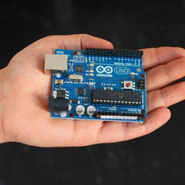
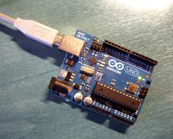

## Introducción a Arduino

[Arduino](http://es.wikipedia.org/wiki/Arduino) [(Arduino en inglés)](http://en.wikipedia.org/wiki/Arduino) 

Cómo podemos leer en la wikipedia:

**Arduino**  es una plataforma de **hardware libre**, basada en una placa de circuito impreso con un microcontrolador y un entorno de desarrollo, diseñada para facilitar el uso de la electrónica en proyectos multidisciplinares

Si leemos la definición de la [propia página de Arduino](http://Arduino.cc/es/):

> Arduino es una plataforma de electrónica abierta para la creación de prototipos basada en software y hardware flexibles y fáciles de usar. Se creó para artistas, diseñadores, aficionados y cualquiera interesado en crear entornos u objetos interactivos.

El objetivo es pues, el conseguir una plataforma fácil de usar para todo tipo de usuarios y permitirle a estos que se centren en su propio trabajo sin tener que dedicar más tiempo del necesario a la plataforma, es decir conseguir una herramienta efectiva que permita a cualquiera realizar proyectos con microcontroladores.

(Aprovecho para recordar el aviso que aparece en la página web de [Arduino en español](http://Arduino.cc/es/): el contenido de esta página está muy desactualizado, por lo que se recomienda que se use el de la página [original en ingles](http://Arduino.cc/). Si tenéis algo de tiempo libre y conocimientos de inglés podíais dedicarlo a traducir alguna de las páginas que quedan pendientes.)

Algo a recalcar acerca de lo relacionado con Arduino es la enorme base de usuarios que existen y lo buena disposición que suelen tener estos a mostrar sus trabajos y publicar cómo los han realizado, documentándolos. Como es fácil imaginar todo esto facilita enormemente el aprendizaje.

Para programar Arduino sólo necesitamos una placa Arduino, un cable USB y el entorno de programación ([IDE](http://es.wikipedia.org/wiki/Entorno_de_desarrollo)) del que hablaremos en el siguiente módulo.

Como decíamos antes, al ser Arduino hardware libre, cualquiera con unos conocimientos mínimos de electrónica puede montarse su propio Arduino, a partir de todas las especificaciones que se pueden descargar desde la página [**Arduino.cc**](http://www.Arduino.cc/)

## Proyectos donde se utiliza Arduino

Basta buscar en la red para ver la cantidad de proyectos que existen basados en Arduino o que lo utilicen.

Un simple vistazo a dos de las comunidades mas activas de DIY, como son [Make](http://makeprojects.com) o [Instructables](http://www.instructables.com/) nos permite ver la cantidad de proyectos que podemos encontrar.

Veamos algunos de ellos para hacernos una idea de qué podemos hacer con
nuestro Arduino:

### Control de un videojuego de conducción con Arduino

 <iframe width="420" height="315" frameborder="0" src="http://www.youtube.com/embed/7MU1xxZLpjg"></iframe>

Es proyecto fin de carrera donde se trata de controlar con los movimientos de un volante (donde está integrado un Arduino) un sencillo
videojuego. Más [detalles sobre el
montaje](http://setr-urjc.blogspot.com.es/2012/04/juego-controlado-por-volante.html)

### Generador de arte por medio de una cafetera

<iframe width="640" height="360" frameborder="0" src="http://www.youtube.com/embed/k1YYesjAen4" allowfullscreen="true"></iframe>

Se trata de medir los parámetros de presión, temperatura, tiempo en diferentes puntos de un cafetera expresso mientras se hace un café espresso. Estos se recogen con un arduino y trasmite los datos a un programa que los representa gráficamente. Posteriormente se imprimen en una etiqueta del vaso donde nos tomaremos nuestro café. Café, arte y arduino. Buena combinación.

Detalles [aquí](http://shinymetalthings.net/thenakedespresso/)

### The Inebriator: Máquina preparadora de cócteles

<iframe width="560" height="315" frameborder="0" src="http://www.youtube.com/embed/hJIkJ9x0-JQ"></iframe>

Este auténtico robot barman capaz de preparar diferentes bebidas.

Podemos ver en el vídeo que incluye un carril móvil por donde se desplaza la vaso. Utiliza diferentes conjuntos de luces de colores para iluminar los diferentes licores. En la imagen de abajo se vé las válvulas que usa para abrir y cerrar la salida de cada botella. Más detalles (aunque no sufivientes) en su [página web](http://www.theinebriator.com/techie-stuff/)

### Controlador real para el juego Angry Birds

<iframe width="500" height="281" frameborder="0" src="http://player.vimeo.com/video/46975682?title=1&amp;byline=1&amp;portrait=1"></iframe>

[Super Angry Birds - a Tangible Controller](http://vimeo.com/46975682)
from [Andrew Spitz](http://vimeo.com/soundplusdesign) on
[Vimeo](http://vimeo.com).

Se trata de un controlador par usar en el conocido juego. Permite ajustar de una forma real la inclinación y la fuerza con la que lanzaremos en el juego.

### Alarma de ultrasonidos con módulos 3G, cámara y teclado numérico para contraseña

<iframe width="560" height="315" frameborder="0" src="http://www.youtube.com/embed/JfW0Ua4Ame4"></iframe>

Es una alarma capaz de tomar una imagen y enviarla por MMS validando un código. Más información en la [página de Arduteka](http://www.arduteka.com/2012/05/tutorial-Arduino-0010-modulo-3g-ultrasonidos-teclado-matricial-led-rgb/)

Exiten multitud de compilaciones de otros proyectos interesantes, como por ejemplo [esta](http://www.cyberhades.com/2010/01/25/top-40-proyectos-para-Arduino-en-la-web/) o [esta](http://www.instructables.com/id/Arduino-Projects/) (en inglés)

Os animo a compartir otros proyectos que os hayan interesado,
relacionados o no con estos.

## Historia de Arduino

{width="464"
height="343"}

Estos son los integrantes del equipo de Arduino. Se trata de un equipo multidisciplinar y de 4 paises distintos:

* David Cuartielles
* Gianluca Martino
* Tom Igoe
* David Mellis
* Massimo Banzi

Veamos algunos puntos importantes de la historia de arduino

* Todos ellos son firmes defensores del sofware libre y conocedores de las grandes ventajas que aporta.

* Puesto que desde el principio tenían claro que pretendía hacer una plataforma fácilmente accesible apostaron por mantener el proyecto lo más abierto a la comunidad posible

* Tenían claro que deseaban que todo el proceso tanto de creación como de producción se realizara íntegramente en Italia

* Su objetivo era conseguir una plataforma completa con coste para el usuario por debajo de los 30 $

* La primera versión la produjo Máximo Banzi en 2005

* Existen
datos de que a día de hoy venden 1 millón de placas al año íntegramente producidas en su fábrica de Italia

Podéis leer la historia completa en este [artículo](http://spectrum.ieee.org/geek-life/hands-on/the-making-of-arduino/0)

Podéis ver un vídeo sobre el proceso de fabricación de arduino

<object width="400" height="225" classid="clsid:D27CDB6E-AE6D-11cf-96B8-444553540000" data="http://www.flickr.com/apps/video/stewart.swf?v=109786" type="application/x-shockwave-flash"> <param value="intl_lang=es-us&amp;photo_secret=bfb55bcb20&amp;photo_id=6662894733" name="flashvars"> <param value="http://www.flickr.com/apps/video/stewart.swf?v=109786" name="movie"> <param value="#000000" name="bgcolor"> <param value="true" name="allowFullScreen"><embed width="400" height="225" flashvars="intl_lang=es-us&amp;photo_secret=bfb55bcb20&amp;photo_id=6662894733" allowfullscreen="true" bgcolor="#000000" src="http://www.flickr.com/apps/video/stewart.swf?v=109786" type="application/x-shockwave-flash">
 </object>

[Arduino The Documentary (2010) Spanish HD](http://vimeo.com/18390711) from [gnd](http://vimeo.com/gnd) on [Vimeo](http://vimeo.com).

Actualmente se ha producido una división en el seno de la empresa, parece ser que por motivos puramente económicos y de gestión.
