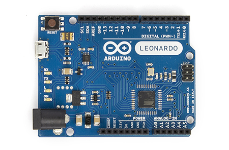
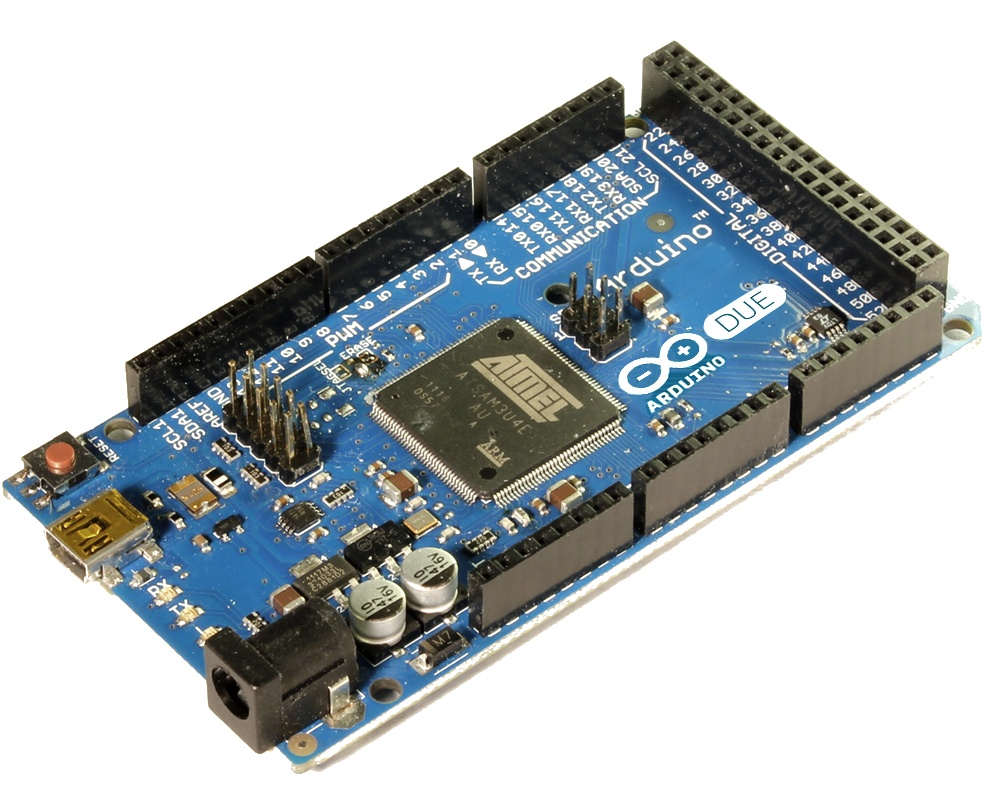

# Hardware de Arduino

Arduino es una plataforma basada en un [microcontrolador](http://es.wikipedia.org/wiki/Microcontrolador), que se encuentra alojado en una placa de [circuito impreso](http://es.wikipedia.org/wiki/Circuito_impreso) que contiene todo lo necesario para ser programada y conectada a multitud de sistemas electrónicos.

Un microcontrolador es un dispositivo electrónico con capacidad de procesamiento (similar a una CPU) y que además se puede conectar a otros dispositivos electrónicos de manera que es capaz de leer y controlar voltajes, lo que le permite accionar dispositivos electrónicos. Como veremos a continuación, es autosuficiente en el sentido que casi no necesita componentes externos para funcionar.

En la placa de Arduino, él único componente fundamental es el microcontrolador, el resto de sólo nos facilitan la conexión o protegen al micro frente a interferencias o sobrevoltajes. Una vez que tenemos un montaje terminado, podrías reducirlo y quedarnos con el micro y nuestros componentes, simplificando la interconexión entre ellos.

Vamos a empezar comparando un microcontrolador con un portátil actual.

En primer lugar comparamos los “números” de los dos sistemas:

Como vemos la capacidad bruta del microcontrolador es varios órdenes de magnitud menor que la de un portátil y aparentemente ridícula si la comparamos con los números a los que estamos acostumbrados a referirnos hoy en día.

Sin embargo, si comparamos su autonomía, es decir cuan autónomo es un microcontrolador, vemos que su ventaja sobre el portátil es apabullante.

* Es autocontenido en el sentido de que sólo necesita alimentación     para funcionar por sí mismo.
* En sí mismo tiene todo lo necesario para autoprogramarse
* Una vez programado, su rendimiento no se deteriora, al contrario que ocurre en los portátiles actuales donde es necesario formatearlos cada cierto tiempo.

Vamos a comparar ahora el tamaño de una placa Arduino con el que solía tener una placa de laboratorio de similares características de hace 5 años:

Salta a la vista que tanto el tamaño como la complejidad se ha redudido enormemente. Además, el coste del entorno de desarrollo podría rondar los 200€ mientras que hoy en día podemos comprar una placa Arduino por 25€

## Hardware de Arduino

### Un poco de historia del Hardware de Arduino

Vemos diferentes versiones de Arduino, lo que nos va a servir para ver la evolución a lo largo de su historia.

El primer prototipo de Arduino apareció allá por el 2005, diseñada por Maximo Banzi. El objetivo era conseguir una plataforma sencilla de usar (no solo para ingenieros) por un precio ajustado y que prácticamente no necesitara de componentes externos para poder hacer montajes.

Veamos algunas diferencias con las placas actuales:

-   Sin programador USB, se usaba el puerto paralelo del pc para transferir los programas
-   Sin puerto de comunicaciones serie, era necesario añadirle más electrónica para comunicarse con el micro
-   Totalmente montada a mano. Como prototipo, no era apta para la producción industrial

Primera versión ya con el aspecto moderno, versión 3 o s3v3 o Arduino Severino, ya tiene un aspecto muy similar a las placas actuales:

-   Conexión para el puerto serie que permite la comunicación con el PC sin más que conectar un cable.
-   Alimentación regulada incluida, lo que facilita su uso enormemente, sobre todo en entornos domésticos.
-   Botón de Reset, que permite reiniciar la placa sin necesidad de desconectarla
-   Pines en su característica disposición actual. Es interesante la historia sobre los [pines     "descolocados"](http://brettbeauregard.com/blog/2009/07/Arduino-offset-header/)     y su [origen](http://www.Arduino.cc/cgi-bin/yabb2/YaBB.pl?num=1212632541/13). Podemos ver que la similitud con una placa actual como la Arduino Uno que tenemos a continuación es grande.

## Hoy

Esta es una de las placas actuales: **Arduino UNO** . Un poco más abajo comentamos sus características.

Por motivos de compatibilidad se han mantenido los conectores desde las primeras versiones, ya que existían muchos complementos que conectaban directamente en la placa

## Placas actuales

Actualmente son muchas las versiones existentes como podemos ver en la imagen siguiente:

1.  Arduino **Duemilanove** es una versión anterior del actual Arduino UNO

2.  Arduino **Bluetooth**, dispone de módulo bluetooth que le permite
    comunicarse de forma inalaámbrica. No incorpora conector USB

3.  Arduino **Mega**, es el grande de la familia, dispone de mayor capacidad y más prestaciones que el resto de Arduinos

4.  Arduino **Pro**, el nombre le viene porque tiene un diseño pensado para el uso profesional, y para facilitar su integración con otros componentes. No incorpora conector USB

5.  Arduino **LilyPad**, está pensado para integrase en prendas de vestir. No incorpora USB.

6.  Arduino **Nano**, uno de los pequeños de la famila, pero no por ello menos pontente. Incorpora en tan reducido espacio las características del Arduino UNO

7.  Arduino **Pro Mini**, similar en prestaciones al Pro, pero de tamaño más reducido

8.  Arduino **Mini**, similar al Arduino pro Mini pero preparado para usuarios domésticos

## Los recién llegados

En la [página de hardware](http://Arduino.cc/it/main/boards) de Arduino podemos ver todos los modelos de placas “oficiales” creados por la empresa Arduino y algunos creados por ésta en colaboración con grandes
empresas como Intel o Texas Instruments.

Decimos “oficiales” por distinguirlos de alguna manera de todas las diferentes versiones que los aficionados y otras empresas han hecho de los diseños orginales.

Como ejemplo de hasta dónde puede llegar el hardware libre, vamos a dar un enlace con un
[documento](https://docs.google.com/spreadsheet/ccc?key=0AsCUiP6WbJIvcG8xalA3QVdmb3JVT0ptWE9VNC02WEE&hl=en_US#gid=0) que pretende clasificar todas las versiones que existentes de Arduino.

Este trabajo colaborativo, recopila a día de hoy ¡¡casi 200 versiones distintas!!

Veamos algunos de los recien llegados:

-   Arduino TRE desarrollado por Arduino en colaboración con Texas     Instruments. Del lado de Arduino monta un ATMega32u4 (el que usa Leonardo) que viene siendo el habitual últimamente. Esta placa es el resultado de la colaboración entre los equipos de desarrollo de Arduino y BeagleBoard.

-   Arduino **Ethernet**: Es como un Arduino Uno, pero con posibilidad de conexión ethernet, que le permite conectar directamente con otros dispositivos. También incluye lector de tarjeta de memoria SD pero no conector USB

-   Arduino **Leonardo**: Además de las características habiltuales de Arduino incorpora la posibilidad de simular dispositivos usb como ratones o teclados

-   Arduino **Due**: Es uno de los hermanos mayores de la familia con unas prestaciones que practicamente duplican las del Arduino Mega .

-   Arduino**Yun**: Es la primera placa de una serie que mezcla arduino con sistemas de mayores prestaciones.

Para dar una primera idea se trata de una placa en la que coexisten un arduino Leonardo y un microordenador linux con wifi, ethernet y USB host (es decir que acepta controlar otros dispositivos como pendrives, webcam, bluetooth, etc…)

-   Intel Galileo creado por Intel pero certificado (un calificativo que veremos a partir de ahora en el mundo Arduino) como 100% compatible. Siguen la misma filosofía de Arduino Yún de integrar un dispositivo
    Arduino completo, con su propio microcontrolador ATMEGA comunicado directamente con la CPU principal.

-   Arduino TRE desarrollado por Arduino en colaboración con Texas Instruments.\
    Del lado de Arduino monta un ATMega32u4 (el que usa Leonardo) que viene siendo el habitual últimamente. Esta placa es el resultado de la colaboración entre los equipos de desarrollo de Arduino y
    BeagleBoard.

-   Zum BT-328 desarrollado por Bq. Entre sus virtudes está el tener un interruptor de apagado, soportar 3A de consumo, un dispositivo bluetooth incorporado y pines en 2 formatos lo que facilita el uso. Más información en su [web](http://www.bq.com/es/productos/zum.html)

## Ampliaciones o Shields

Además de las placas que hemos visto hasta ahora también existen unas placas que conectadas a una placa Arduino amplían su funcionalidad, se les llama Shields. Estas placas encajan encima de una placa de Arduino conectándose entre sí y aumentando la funcionalidad del conjunto. Existen multitud de shields, entre ellos
veamos los siguientes:

-   **Wifi** : dispone de conectividad Wifi y un conector para tarjeta SD. Aunque no es lo normal, este shield permite funcionamiento aislado, sin necesidad de Arduino.

-   **Ethernet** : añade conectividad ethernet y un conector de tarjeta SD

-   **Motor** : este shield dispone de toda la electrónica necesaria para controlar motores con Arduino

-   **Protoshield** : permite integrar nuestros propios montajes en una placa Arduino

* * * * *

Una historia curiosa sobre arduino DUE, el micro que utiliza el Due, el [SAM3X nativamente soporta ethernet](http://tronixstuff.com/2013/02/08/first-look-arduino-due/), eso quiere decir que "sólo" hay que añadir un poco de hardware (casi todo electrónica analógica) para que la placa tenga ethernet. En las primeras etapas de desarrollo de la placa todo se complicó y esta características se abandonó.En este [enlace](http://forum.arduino.cc/index.php/topic,142908.0.html) se explica como añadir externamente esa electrónica. Esta historia me la contó un chaval que participó en el desarrollo del DUE. Siempre he mantenido la esperanza de que alguien comercializara una pequeña plaquita, pero parece que no es demasiado fácil, porque hay que acceder a algunos pines del micro que no son accesibles en la placa.

## ¿Y si no tengo ninguna placa de Arduino?

Veamos ahora los simuladores existentes que nos permiten programar y probar nuestro código sin la necesidad de tener una placa Arduino. Hay que decir que existen multitud de proyectos dedicados a simular placas Arduino, tanto comerciales como gratuitos. Esta lista no pretende ser exhaustiva sino que se basa en la corta experiencia en este campo de los simuladores del autor.

En caso de encontrar algún otro simulador interesante no dudéis en enviarlo a los foros para que lo estudiemos y lo incluyamos en esta lista.

|captura|URL|descripcion|
|---|---|---|
||[123d.circuit.io](http://123d.circuit.io)|Es un simulador de arduino en la página del diseñador de circuitos 123d.circuit.io. Nos permite simular perfectamente la mayoría de los montajes del curso. He preparado un [**vídeo**](https://www.youtube.com/watch?v=c0edvZIrjUY "Breve Tutorial sobre 123d circuits.io") para que aprendáis a usarlo|
||[Minibloq](http://blog.minibloq.org "minibloq")|Es un entorno de programación de Arduino compuesto por un editor de bloques (al estilo de Scratch). Como salida produce un fichero que podemos introducir en le entorno de Arduino. Está en versión Beta aún. Como incoveniente, no nos permite introducir el código, sino que hemos de usar los bloques predefinidos y a partir de ahí vemos el código resultante.
||[Virtualbreadboard](http://virtualbreadboard.com/ "virtualbreadboard")|Es un simulador de componentes y de Arduino (también permite simular placas de otra familia de microcontroladores llamadas PicMicro). Es un software **comercial de pago**. La versión gratuita permite simular los componentes eletrónicos pero no a Arduino. Para ello es necesario adquirir el "Arduino Toolkit".
||[Simulator for Arduino](http://virtronics.com.au/Simulator-for-Arduino.html)|Software **comercial de pago** bastante potente y bien terminado. Permite simular el funcionamiento de Arduino y hacer programas. Existe una versión gatuita que impone un retardo al cargar los programas.
||[emulino](http://)| Entorno gratuito de emulación completo. Se requieren conocimientos medios para ponerlo en funcionamiento. Se puede descargar el código de [github](http://github.com/ghewgill/emulino/tree/master). No recomendado si no tienen conocimientos avanzados para compilar programas|
||[Ardusim](http://sourceforge.net/projects/ardusim/)|es un emulador gratuito de Arduino que corre dentro de [codeblocks](http://www.codeblocks.org) (un entorno de desarrollo totalmente gratuito para C++ que descargarse e instalar para usarlo). Permite depurar nuestros programas y aunque no tiene una interface gráfica como alguno de los otros emuladores comerciales es bastante cómodo de usar y el mejor, a mi juicio de entre los gratuitos.
Para instalarlo es necesario descargar previamente el entorno donde se ejecuta llamado codeblocks, del que ya existen versiones compiladas y listas para usar de las plataformas más recientes en la [página de descargas](http://www.codeblocks.org/downloads/binaries). Una vez instalado el entorno hay que descargar el [código de ArduSim](http://sourceforge.net/p/ardusim/code/44/tree/trunk/ardusim/). Como no he visto una manera fácil de descargar sin tener que instalar nada más, copio aquí el [fichero para descargarlo](http://ecampus.ugr.es/moodle/draftfile.php/900/user/draft/924132861/ardusim.zip).
Para ejecutarlo en codeblocks, tenemos que abrir el fichero ardusim.cbp . Una vez abierto podemos modificar el código de Arduino para ejecutar en el fichero sketch.cpp en la carpeta sketch.\
Un tutorial en [vídeo](http://www.youtube.com/watch?v=kj8OXhB5VpA)\
||[Simuino](http://www.Arduinodev.com/simuino/)|s un simulador gratuito que puede usarse en 2 versiones: en terminal (sin gráficos, únicamente con caracteres) y en versión web. Es necesario descargar el [código](http://code.google.com/p/simuino/) y [compilarlo](http://web.simuino.com/get-started), lo cual es sencillo bajo linux.|
