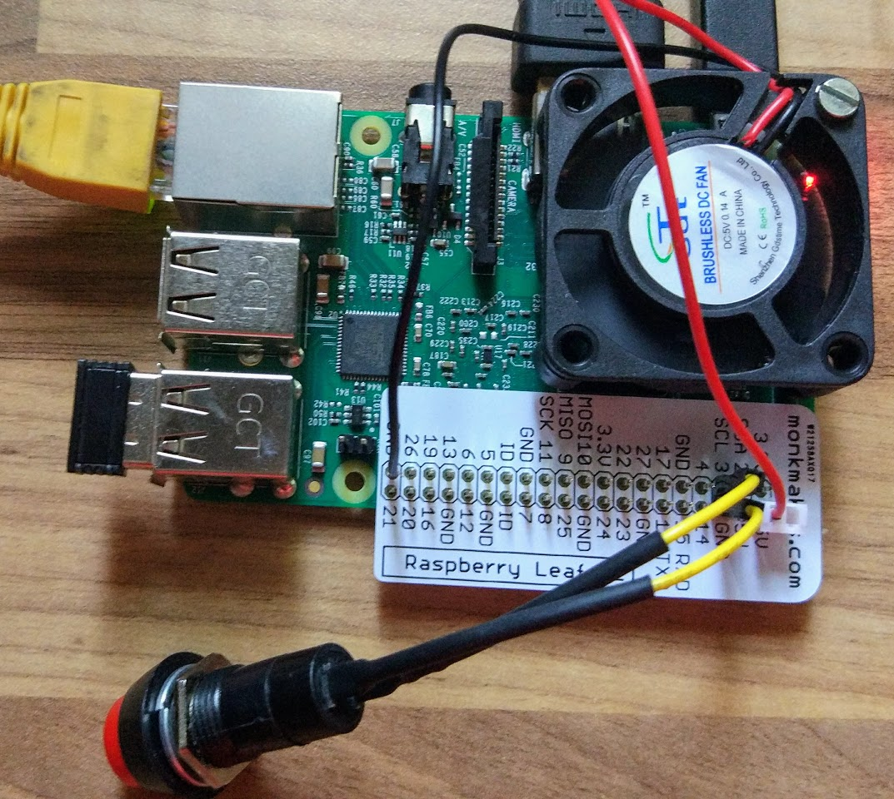

# On/Off

(Basado en [este tutorial](https://howchoo.com/g/mwnlytk3zmm/how-to-add-a-power-button-to-your-raspberry-pi))

Desgraciadamente la Raspberry Pi (ni siquiera en su versión 3) tiene un botón de encendido apagado.

Sí que dispone de una funcionalidad hardware que permite arrancarla desde el estado Halt cuando se detecta un estado a 0V del GPIO 3

El arranque desde el estado Halt es fácil de resolver, basta con conectar un pulsador entre el GPIO 3 y GND (pines 5 y 6). Para ello usaré un pulsador del [Squid Combo Pack de  MonkMakes](https://www.monkmakes.com/squid_combo) (También he utilizado una placa-etiqueta del mismo kit para no liarla en la conexión)

Para el apagado vamos a crear unos script que vigilen (mediante interrupciones para no consumir CPU) el estado del GPIO 3 y en caso de que detecte que está a 0v pongan la Raspberry en estado Halt (en la imagen también se ve que he añadido un ventilador para mantener la raspberry fresquita en este tórrido verano)

El script (_listen-for-shutdown.py_) para detectar la pulsación del botón es muy sencillo (tomado del [tutorial de howchoo](https://howchoo.com/g/mwnlytk3zmm/how-to-add-a-power-button-to-your-raspberry-pi) )

    #!/usr/bin/env python

    import RPi.GPIO as GPIO
    import subprocess

    GPIO.setmode(GPIO.BCM)
    GPIO.setup(3, GPIO.IN)
    GPIO.wait_for_edge(3, GPIO.FALLING)

    subprocess.call(['shutdown', '-h', 'now'], shell=False)

Ahora damos permisos de ejecución

    chmod u+x listen-for-shutdown.py

Si ejecutamos el script con sudo (porque necesitas permisos de administrador para hacer el shutdown) vemos que funciona perfectamente

    sudo ./listen-for-shutdown.py

Si una vez apagada volvemos a pulsar el bton veremos que arranca limpiamente.

Ahora necesitamos que el script se ejecute directamente al arrancar la Raspberry. Para ello debemos copiarlo al directorio adecuado

    sudo mv listen-for-shutdown.py /usr/local/bin/

Y crear el script _listen-for-shutdown.sh_ que lo arranque/pare como servicio

    #! /bin/sh

    ### BEGIN INIT INFO
    # Provides:          listen-for-shutdown.py
    # Required-Start:    $remote_fs $syslog
    # Required-Stop:     $remote_fs $syslog
    # Default-Start:     2 3 4 5
    # Default-Stop:      0 1 6
    ### END INIT INFO

    # If you want a command to always run, put it here

    # Carry out specific functions when asked to by the system
    case "$1" in
      start)
        echo "Starting listen-for-shutdown.py"
        /usr/local/bin/listen-for-shutdown.py &
        ;;
      stop)
        echo "Stopping listen-for-shutdown.py"
        pkill -f /usr/local/bin/listen-for-shutdown.py
        ;;
      *)
        echo "Usage: /etc/init.d/listen-for-shutdown.sh {start|stop}"
        exit 1
        ;;
    esac

    exit 0

Lo copiamos al directorio donde se guardan los script de  arrancan (/etc/init.d)

    sudo mv listen-for-shutdown.sh /etc/init.d/
    sudo chmod +x /etc/init.d/listen-for-shutdown.sh

Sólo nos queda registrar el script para que se inicie en el arranque

    sudo update-rc.d listen-for-shutdown.sh defaults

Para probarlo arrancamos manualmente el servicio con

    sudo service listen-for-shutdown start

Al pulsar el botón por primera vez se apagará y volverá
