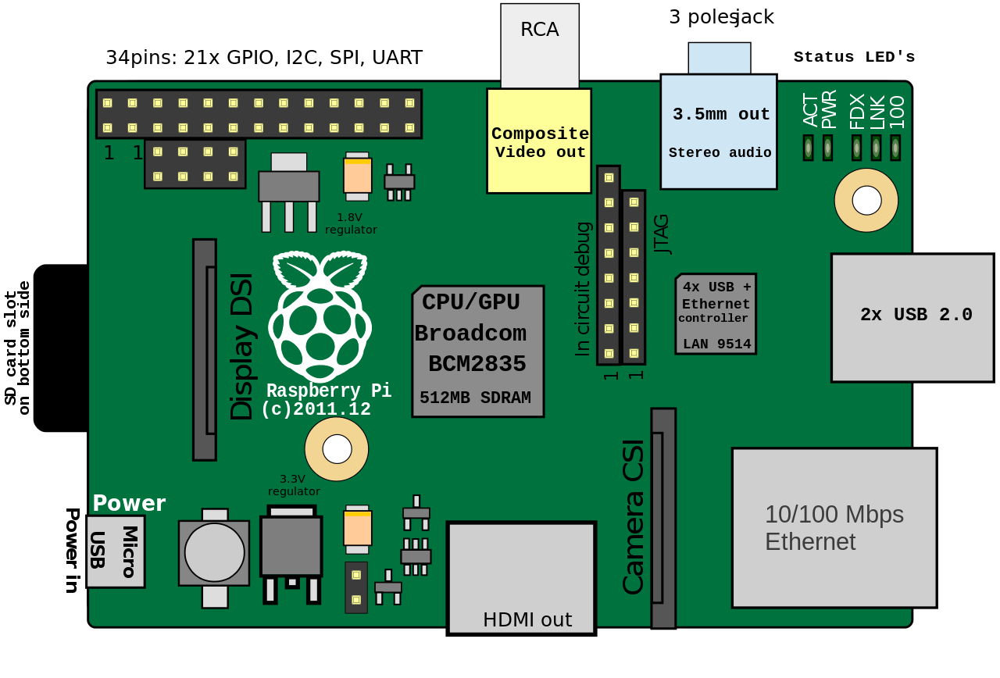
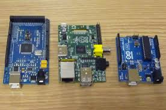

# Tema 5 - ¿Qué es Raspberry?

Raspberry Pi se ha convertido, junto con Arduino, en uno de los máximos exponentes del desarrollo casero y profesional basado en herramientas libres, pudiendo ser una plataforma hardware de desarrollo, un pequeño ordenador personal sobre el que programar, navegar o editar un documento de texto, un reproductor de música, películas o imágenes, o la base sobre la que construir un sistema de almacenamiento en red para compartir archivos entre los equipos que tengamos en nuestra red.

El Raspberry Pi se puede convertir fácilmente, por tanto, en un ordenador versátil utilizando cualquier teclado y ratón convencional USB. Además tiene un conector Ethernet para enchufarse a la red local y a Internet y una salida HDMI de vídeo. Por sus características y bajo precio, se ha convertido en una plataforma con muchísimo potencial que contribuye a desarrollar habilidades tecnológicas, promoviendo el aprendizaje de lenguajes de programación como Python, C o Perl, llevando el mundo de la programación a todo aquel que tenga interés en aprender, experimentar y realizar sus propios proyectos.

### Los objetivos del curso son:

* Familiarizarse con la plataforma Raspberry Pi, aprendiendo a instalar y a usarla para
diferentes fines.
* Aprender a realizar programas usando lenguajes de scripts como Python o Perl
* Aprender a montar proyectos con electrónica que se puedan controlar desde la plataforma

### Esquema del curso

- Introducción
- Características generales de la placa Raspberry Pi. Hardware
- Primeros pasos con Raspberry Pi. Software
- Lenguaje de programación y entorno de desarrollo integrado
- Utilización de librerías externas para programación
- Conexión con equipos electrónicos y Arduino

## Orígenes

La intención era crear un sistema barato que nos permitiera enseñar a programar a niños y adultos.

* En 2005, la Universidad de Cambridge notó como cada vez menos estudiantes quería estudiar informática

* Pensaron que la solución podía ser un ordenador superbarato con el que pudieran jugar, aprendiendo en el camino.

* Se empezó a construir en 2006, pero era difícil

* En 2009 ya existía la tecnología necesaria y se creó "Raspberry Pi Fundation" administrada por Eben Upton

* En 2011 aparecen los primeros prototipos y se ven factibles modelos de 25$ y 35$. Aparece el modelo B Beta

Utiliza un diseño avanzado

##  [Versiones](https://www.raspberrypi.org/documentation/hardware/raspberrypi/models/README.md)

[Version 3](https://www.raspberrypi.org/products/raspberry-pi-3-model-b/) (1.2GHz quad core 1Gb Wifi y bluetooth)

[Version 0](https://www.raspberrypi.org/products/pi-zero/) (1Ghz 512Mb)

[Versión 2 B](https://www.raspberrypi.org/products/raspberry-pi-2-model-b/) (900MHz quad core y 1Gb)

[Versión B+](https://www.raspberrypi.org/documentation/hardware/raspberrypi/models/README.md#modelbplus) 2014

Versión B (512M y ethernet)

Versión A (256MB)

[La llegada de los clones](./clones.md)

### Refencias

[Artículo de la wikipedia sobre RaspBerry Pi](https://en.wikipedia.org/wiki/Raspberry_Pi)

[Products at Raspberry.org](https://www.raspberrypi.org/products/ )

[Tabla de los distintos modelos y sus características](https://es.wikipedia.org/wiki/Raspberry_Pi#Especificaciones_t.C3.A9cnicas)

[Comparativa Raspberry 2](https://learn.adafruit.com/introducing-the-raspberry-pi-2-model-b?view=all)

## Arquitectura

Un diagrama simplificado de la arquitectura de Raspberry Pi

## ¿Raspberry Pi vs Arduino?

Una pregunta muy frecuente es si para determinado proyecto es mejor usar Arduino o Raspberry Pi.

* Arduino es más robusto eléctricamente: si se produce un cortocircuito entre pines o se comente un error se apagará y reseteará pero las probabilidades de romperlo son bajas. En cambio si hacemos esto mismo con una Raspberry lo más seguro es que la dejemos inservible.

Algunas ventajas de Arduino:
* Es capaz de dar una mayor corriente por cada patilla (hasta 40mA) mientras que Raspberry no puede dar más de 5mA
* Dispone de entradas analógicas, es decir, es capaz de leer valores intermedios entre 0 y 5v, no solo digitales como raspberry
* La sencillez de su funcionamiento (como microcontrolador ) le aporta una gran robustez a la hora de soportar cortes de alimentación.
* Últimamente están apareciendo diversas versiones de Arduino con mayor capacidad, soportando una programación más compleja y potente, como Yún o Galileo.

* Raspberry Pi tiene una mayor capacidad de procesamiento, lo que la hace más adecuada para determinadas tareas, como reconocimiento de imágenes o cálculos complejos, algo que sería impensable para Arduino.

* Raspberry Pi dispone de mayor capacidad de almacenamiento y de memoria permitiendo utilizar programación más avanzada.

* Raspberry Pi es un entorno completo, no necesita de ningún dispositivo externo para programarse

* ¿Son incompatibles? en absoluto lo más frecuente y es usarlas conjuntamente, conectándolos y haciendo que la Raspberry actúe como cerebro y Arduino como ejecutor.

Vistas las diferencias entre los dos dispositivos queda claro que son perfectamente complementarios:

* Donde uno adolece de poco cerebro, el otro aporta gran procesamiento
* Donde uno es eléctricamente débil, el otro es robusto

## Raspberry en los medios

Han sido muchas las películas y series donde han aparecido últimamente Raspberry Pi

* [Serie Mr. Robot](http://null-byte.wonderhowto.com/how-to/hacks-mr-robot-build-hacking-raspberry-pi-0163143/): utilizan como punto de acceso externo y para inyectar datos erróneos en el sistema de control de temperatura y así poder controlarlo.

[Vídeo de Mr. Robot](https://www.youtube.com/watch?v=55jypw_xAo0)

* CSI Cyber: lo usan como un router que les permite capturar datos de la red donde están (un parque de atracciones) y así descubren como poder controlar las atracciones.

## Documentación sobre Raspberry Pi

### Revistas

[Revista The MagPy](https://www.raspberrypi.org/magpi/)

[Todos los números](https://www.raspberrypi.org/magpi/issues/)

[Libro de proyectos](https://www.raspberrypi.org/magpi/raspberry-pi-projects-book-2/)

### Libros

* Programing the Raspberry Pi, Simon Monk
* Raspberry Pi for Secret Agents
* Raspberry Pi Gamming

### Tutoriales

[Raspberry pi Class (instructables)](http://www.instructables.com/class/Raspberry-Pi-Class/?utm_source=newsletter&utm_medium=email)

[Vídeo tutorial Raspberry Pi (sparkfun)](https://www.youtube.com/watch?v=b6h95jNWg1g)

[Vídeo tutorial Raspberry Pi 2 (sparkfun)](https://www.youtube.com/watch?v=jmPgdcec53s)

[Tutoriales de Adafruit](https://learn.adafruit.com/search?q=raspberry)

[Tutoriales de sparkfun](https://www.sparkfun.com/search/results?term=raspberry)
