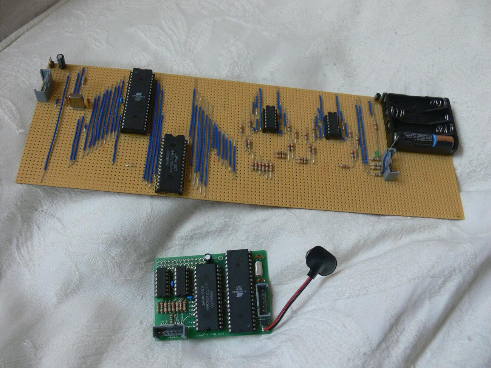
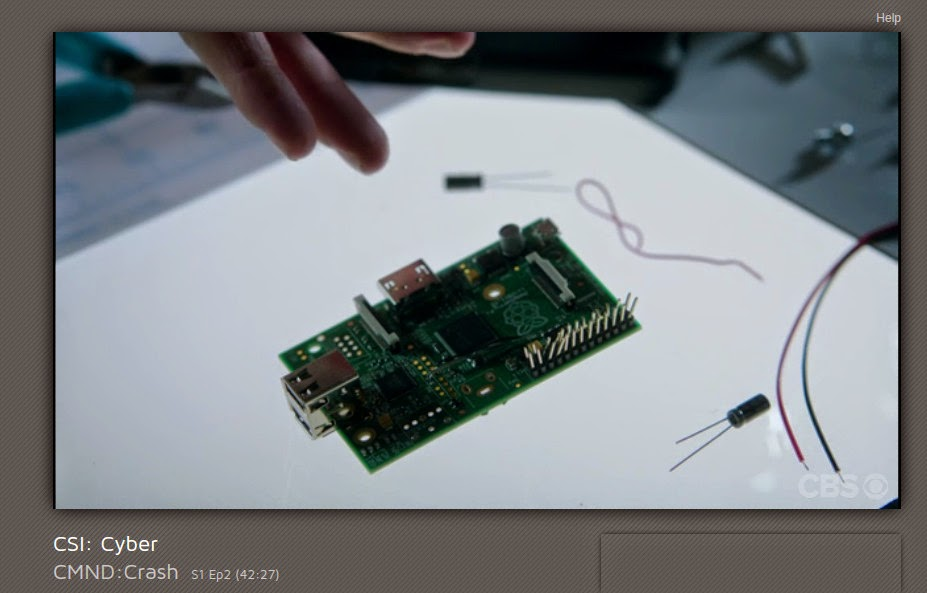
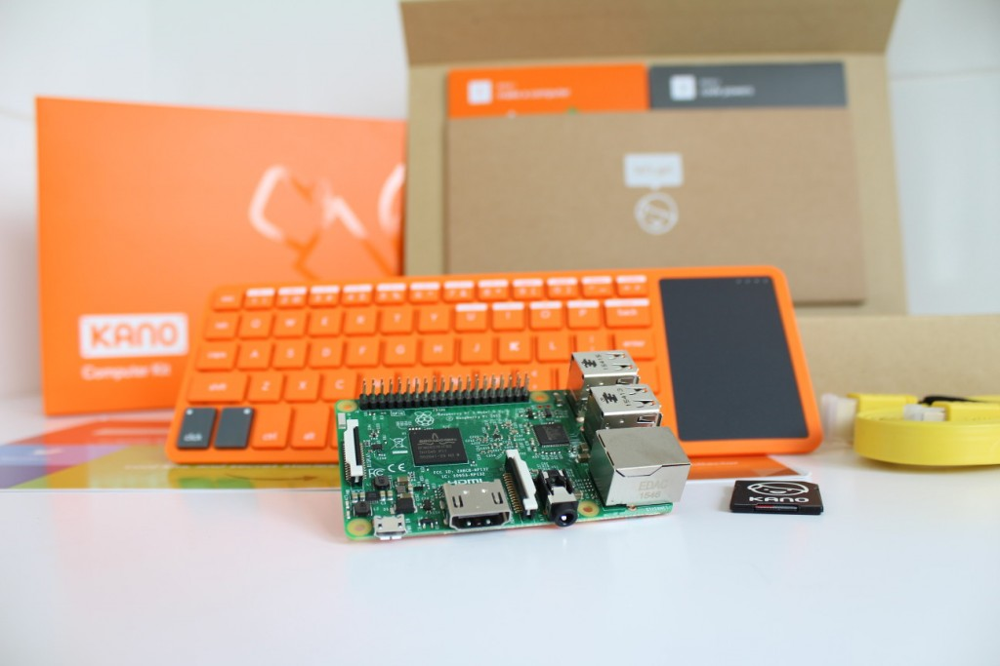

# Tema 5 - ¿Qué es Raspberry?

Raspberry Pi se ha convertido, junto con Arduino, en uno de los máximos exponentes del desarrollo casero y profesional basado en herramientas libres, pudiendo ser una plataforma hardware de desarrollo, un pequeño ordenador personal sobre el que programar, navegar o editar un documento de texto, un reproductor de música, películas o imágenes, o la base sobre la que construir un sistema de almacenamiento en red para compartir archivos entre los equipos que tengamos conectados.

Raspberry Pi se puede convertir fácilmente, por tanto, en un ordenador versátil utilizando cualquier teclado y ratón convencional USB. Además tiene un conector Ethernet para enchufarse a la red local y a Internet y una salida HDMI de vídeo. Por sus características y bajo precio, se ha convertido en una plataforma con muchísimo potencial que contribuye a desarrollar habilidades tecnológicas, promoviendo el aprendizaje de lenguajes de programación como Python, C o Perl, llevando el mundo de la programación a todo aquel que tenga interés en aprender, experimentar y realizar sus propios proyectos.

### Objetivos del módulo

* Familiarizarse con la plataforma Raspberry Pi, aprendiendo a instalar y a usarla para
diferentes fines.
* Aprender a realizar programas sencillos usando lenguajes de scripts como Python o Shell
* Aprender a montar proyectos fáciles con electrónica que se puedan controlar desde la plataforma

### Esquema del módulo

- Introducción
- Características generales de la placa Raspberry Pi. Hardware
- Primeros pasos con Raspberry Pi. Software
- Lenguaje de programación y entorno de desarrollo integrado
- Conexión con equipos electrónicos y Arduino

## Orígenes de Raspberry Pi

La intención de los creadores de Raspberry era crear un sistema barato que nos permitiera enseñar a programar a niños y adultos.

* En 2005, la Universidad de Cambridge notó como cada vez menos estudiantes quería estudiar informática

* Pensaron que la solución podía ser un ordenador superbarato con el que pudieran jugar, aprendiendo en el camino.

* Se empezó a construir en 2006, pero era difícil con la electrónica de la época

* En 2009 ya existía la tecnología necesaria y se creó "Raspberry Pi Fundation" administrada por Eben Upton

* En 2011 aparecen los primeros prototipos y se ven factibles modelos de 25$ y 35$. Aparece el modelo B Beta

  

Utiliza un diseño avanzado, como podemos ver en la imagen donde se ve que se ha colocado un chip encima de otro.

La versión más actual es la [Versión 3](https://www.raspberrypi.org/products/raspberry-pi-3-model-b/) (1.2GHz quad core 1Gb Wifi y bluetooth)

y la versión [Zero](https://www.raspberrypi.org/products/pi-zero/) (1Ghz 512Mb)

Puedes encontrar más detalles en la [página de la wikipedia]([Artículo de la wikipedia sobre RaspBerry Pi](https://en.wikipedia.org/wiki/Raspberry_Pi)

## Raspberry Pi vs Arduino

Una pregunta muy frecuente es si para determinado proyecto es mejor usar Arduino o Raspberry Pi.

* Arduino es más robusto eléctricamente: si se produce un cortocircuito entre pines o se comente un error se apagará y reseteará pero las probabilidades de romperlo son bajas. En cambio si hacemos esto mismo con una Raspberry lo más seguro es que la dejemos inservible.

Algunas ventajas de Arduino:
* Es capaz de dar una mayor corriente por cada patilla (hasta 40mA) mientras que Raspberry Pi no puede dar más de 5mA
* Dispone de entradas analógicas, es decir, es capaz de leer valores intermedios entre 0 y 5v, no solo digitales como Raspberry Pi
* La sencillez de su funcionamiento (como microcontrolador ) le aporta una gran robustez a la hora de soportar cortes de alimentación.
* Últimamente están apareciendo diversas versiones de Arduino con mayor capacidad, soportando una programación más compleja y potente, como Yún o Galileo.

* Raspberry Pi tiene una mayor capacidad de procesamiento, lo que la hace más adecuada para determinadas tareas, como reconocimiento de imágenes o cálculos complejos, algo que sería impensable para Arduino.

* Raspberry Pi dispone de mayor capacidad de almacenamiento y de memoria permitiendo utilizar programación más avanzada.

* Raspberry Pi es un entorno completo, no necesita de ningún dispositivo externo para programarse

* ¿Son incompatibles? en absoluto lo más frecuente y es usarlas conjuntamente, conectándolos y haciendo que la Raspberry actúe como cerebro y Arduino como ejecutor.

Vistas las diferencias entre los dos dispositivos queda claro que son perfectamente complementarios:

* Donde uno adolece de poco cerebro, el otro aporta gran procesamiento
* Donde uno es eléctricamente débil, el otro es robusto

## Raspberry en los medios

Han sido muchas las películas y series donde han aparecido últimamente Raspberry Pi

* [Serie Mr. Robot](http://null-byte.wonderhowto.com/how-to/hacks-mr-robot-build-hacking-raspberry-pi-0163143/): utilizan como punto de acceso externo y para inyectar datos erróneos en el sistema de control de temperatura y así poder controlarlo.

  

* CSI Cyber: lo usan como un router que les permite capturar datos de la red donde están (un parque de atracciones) y así descubren como poder controlar las atracciones.

  

¿Cónoces alguna aparición más en los medios? No dudes en contárnosla.

## Proyectos

Vamos a ver algunos proyectos donde se usa una (o varias) Raspberry Pi

### Enseñanza

Existen [distribuciones  educativas](https://learn.adafruit.com/adafruit-raspberry-pi-educational-linux-distro)

Podemos montar [Aulas informatica](https://www.raspberrypi.org/blog/bringing-computing-to-rural-cameroon/)

También podemos hacer un [servidor de aula con los contenidos de (Kahn Academy Offline)](http://www.raspberrypi.org/archives/3829?sf12291563=1)

	Raspebrry 35$
	SD 64Gb 50$
	Wifi USB 5$
	Caja 9$

### Instrumentación de Laboratorio

Añadiendo algo de hardware externo podemos utilizarlo como equipamiento de laboratorio.

* Generadores de onda
[DAC](https://learn.adafruit.com/mcp4725-12-bit-dac-with-raspberry-pi)

  

* [Analizador de precuencias](https://learn.adafruit.com/freq-show-raspberry-pi-rtl-sdr-scanner)

  

### [MediaCenter](https://learn.adafruit.com/raspberry-pi-as-a-media-center)

Uno de los usos más frecuentes es como MediaCenter, hasta existen distribuciones dedicadas a ello.

### MediaCenter

[How to make a MediaCenter](https://learn.adafruit.com/raspberry-pi-as-a-media-center?view=all)

### Robots

[Raspberry y Lego Minstorm](https://learn.sparkfun.com/tutorials/getting-started-with-the-brickpi?_ga=1.260570443.733603098.1443800444)

### [Minecraft](https://learn.adafruit.com/running-minecraft-on-a-raspberry-pi)

Juega a MineCraft desde tu RaspBerry Pi

### [Arte](https://learn.adafruit.com/light-painting-with-raspberry-pi)

### [Iluminación](https://learn.adafruit.com/neopixels-on-raspberry-pi)

### [Kano: portátil  basado en raspberrypi](http://www.raspberrypi-spy.co.uk/2016/04/kano-computer-kit-first-impressions/)

### Cerebro de una instalación domótica

[Regulación de temperatura](https://tackk.com/nightcooling)

## Servidor NAS

Puedes usar tu Raspberry como [servidor de ficheros](https://www.adslzone.net/2016/08/24/convierte-cualquier-disco-duro-nas-gracias-la-raspberry-pi-3/)

### Streaming

[Radio wifi](https://learn.adafruit.com/pi-wifi-radio?view=all)

## Data crunching: supercoputación

* [Cluster de supercomputación](http://www.cyberhades.com/2014/02/19/tutorial-para-instalar-un-cluster-de-40-nodos-con-raspberry-pi/)

* [Minería de BitCoin](https://learn.adafruit.com/piminer-raspberry-pi-bitcoin-miner)

## Cámara

[SnapPiCam](https://learn.adafruit.com/snappicam-raspberry-pi-camera)

## Máquina de juegos

* [Mame](https://learn.adafruit.com/retro-gaming-with-raspberry-pi?view=all)

* [Mini máquina recreativa](https://learn.adafruit.com/cupcade-raspberry-pi-micro-mini-arcade-game-cabinet?view=all)

* [Cómo instalar y jugar al clásico videojuego  Doom](https://learn.sparkfun.com/tutorials/setting-up-raspbian-and-doom?_ga=1.227922267.733603098.1443800444)

  

* [Minecraft](https://learn.adafruit.com/running-minecraft-on-a-raspberry-pi)

  

## Instrumentos de tortura

No te asustes es sólo un [láser que se mueve aleatoriamente](https://learn.adafruit.com/raspberry-pi-wifi-controlled-cat-laser-toy?view=all)
 y que le encantará a tu gato

  

* [Cuadro diabólico](https://learn.adafruit.com/creepy-face-tracking-portrait?view=all)

## Arte

* [Ligth Painting](https://learn.adafruit.com/light-painting-with-raspberry-pi)

* [Iluminación](https://learn.adafruit.com/neopixels-on-raspberry-pi)

* [Cortina luminosa](https://learn.adafruit.com/1500-neopixel-led-curtain-with-raspberry-pi-fadecandy?view=all)

### Juegos Portables

[Raspberry Pi Gameboy](https://learn.adafruit.com/pigrrl-raspberry-pi-gameboy?view=all)

[Super consola](https://learn.adafruit.com/super-game-pi?view=all)

[Retro consola](https://www.instructables.com/id/Breadboard-RetroPie/?utm_source=newsletter&utm_medium=email)

## Teléfono

[RaspiPhone es un teléfono basado en Raspberry Pi](https://learn.adafruit.com/piphone-a-raspberry-pi-based-cellphone?view=all)

## Coche

[Datalogger de datos del coche](http://www.stuffaboutcode.com/2013/07/raspberry-pi-reading-car-obd-ii-data.html)

[Seguidor de flotas](http://www.stuffaboutcode.com/2013/10/raspberry-pi-car-cam-gps-data-map.html)

### Exteriores

Su bajo peso, y los pocos periféricos de los que depende, facilitan su uso en entornos aislados

Sí que tendremos que tener en cuenta el aislamiento, para soportar las temperaturas que nos vamos a encontrar, unas buenas baterías para poder alimentarla.

Incluso podemos llegar a lanzarla al espacio, como en el proyecto [astroPi](https://astro-pi.org/)

	

	

O volando en drone usando  [Autopilot](http://erlerobotics.com/blog/meet-the-last-autopilot-for-building-robots-erle-brain-2/)

## Proyectos

* [Portable Raspberry](https://learn.adafruit.com/touch-pi-portable-raspberry-pi)

* [MiniPortatil](https://learn.adafruit.com/mini-raspberry-pi-handheld-notebook-palmtop)

Más detalles en el libro "RP para agentes secretos"

### Hacking

Otra utilización cada vez más frecuente es como herramienta de Hacking, puesto que su pequeño tamaño y la cantidad de herramientas disponible la hacen ideal para estos usos.

En el libro "Raspberry Pi para agentes secretos" puedes encontrar como usarla como sniffer Wifi

Hay quien incluso la esconde dentro de una regleta [Turn a Raspberry Pi Into a Super Cheap, Packet-Sniffing Power Strip](http://lifehacker.com/six-great-diy-projects-for-hacking-computers-and-networ-1649618886)

Si por el contrario lo que quieres hacer es hackear una Raspberry Pi, en este [enlace](https://geekytheory.com/hacking-raspberry-pi/) puedes ver cómo hacerlo.

## Documentación sobre Raspberry Pi

Existe mucha documentación sobre Raspberry Pi, veamos alguna de ella.

### Revistas

La principal revista (mensual) sobre Rasperry Pi es [The MagPy](https://www.raspberrypi.org/magpi/). Es una fuente de información extraordinaria, repleta de proyectos y consejos. Se puede descargar gratuitamente pero si compras la edición en papel suele traer regalos. El famoso número 40 de la revista ¡regalaban un Rasperry Pi Zero! por los 5€ que cuesta. Ni que decir tiene que se agotó rápidamente.

Puedes descargar [todos los números](https://www.raspberrypi.org/magpi/issues/) directamente.

También ha creado un [libro de proyectos](https://www.raspberrypi.org/magpi/raspberry-pi-projects-book-2/)

### Libros

Te recomiendo estos 3 libros.  

* Programing the Raspberry Pi, Simon Monk: es un clásico y en sus 90 páginas encontrarás casi todo lo que necesitas saber para manejar y programar tu Raspberry Pi.
* Raspberry Pi for Secret Agents: tiene proyectos más avanzados
* Raspberry Pi Gamming: te enseña a hacer juegos con la Raspberry Pi

### Tutoriales

Algunos tutoriales para aprender rápidamente a manejar tu Raspberry Pi

[Raspberry pi Class (instructables)](http://www.instructables.com/class/Raspberry-Pi-Class/?utm_source=newsletter&utm_medium=email)

[Vídeo tutorial Raspberry Pi (sparkfun)](https://www.youtube.com/watch?v=b6h95jNWg1g)

[Vídeo tutorial Raspberry Pi 2 (sparkfun)](https://www.youtube.com/watch?v=jmPgdcec53s)

[Tutoriales de Adafruit](https://learn.adafruit.com/search?q=raspberry)

[Tutoriales de sparkfun](https://www.sparkfun.com/search/results?term=raspberry)
