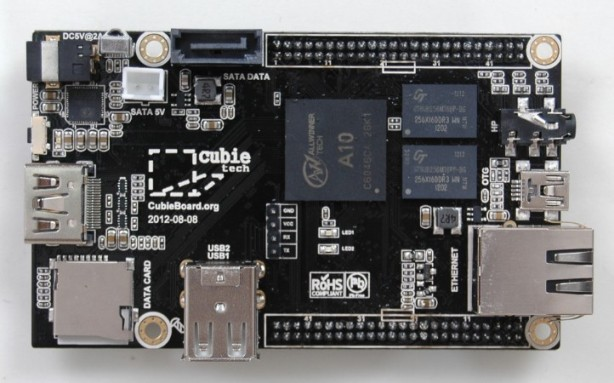

# Tema 6 - Características de Raspberry

En este tema vamos a hablar sobre el hardware de Raspberry

## Arquitectura

Un diagrama simplificado de la arquitectura de Raspberry Pi

En estos dibujos esquemáticos podemos ver los distintos conectores:

* USB: podremos conectar cualquier dispositivo USB, pero teniendo en cuenta que no debe consumir demasiado.
* HDMI: conectamos el monitor HDMI
* LAN: típico conector RJ45 para cable ethernet
* Algunas versiones tienen salidas de vídeo en formato RCA
* MicroUSB por el que alimentaremos
* Conector CSI para la cámara
* Conector DSI para un monitor específico
* GPIO, 40 pines accesibles para utilizar como entradas y salidas. Hay que tener mucho cuidado con ellos porque están conectados directamente el microprocesador y podríamos estropearlo fácilmente.

En este diagrama vemos los dispositivos que se pueden conectar a la Raspberry Pi

## Modelos

Hasta la fecha se han creado diferentes modelos, cada vez con mayores prestaciones.

En el siguiente enlace podemos leer en detalle sobre las diferentes  [Versiones](https://www.raspberrypi.org/documentation/hardware/raspberrypi/models/README.md)

La versión más actual es la [Version 3](https://www.raspberrypi.org/products/raspberry-pi-3-model-b/)

Dispone de un procesador quad core a 1.2GHz con 1Gb, Wifi y bluetooth, 4 USB, HDMI, ethernet y salida de audio.

y la [Zero](https://www.raspberrypi.org/products/pi-zero/)

Es una versión superreducida con el mismo procesador pero a 1Ghz y  512Mb de RAM. La gran diferencia es que casi no dispone de conectores, para así reducir su tamaño y precio ¡Cuesta 5€!

### Versión antiguas

[Versión 2 B](https://www.raspberrypi.org/products/raspberry-pi-2-model-b/) (900MHz quad core y 1Gb)

[Versión B+](https://www.raspberrypi.org/documentation/hardware/raspberrypi/models/README.md#modelbplus) 2014

Versión B (512M y ethernet)

Versión A (256MB)

### Referencias

[Products at Raspberry.org](https://www.raspberrypi.org/products/)

[Tabla de los distintos modelos y sus características](https://es.wikipedia.org/wiki/Raspberry_Pi#Especificaciones_t.C3.A9cnicas)

## ¿Clones?

En el mercado han aparecido muchas empresas que sin llegar a copiar directamente la Raspberry, han producido equipos muy similares, en prestaciones y tamaños.

Además algunos de ellos, son treméndamente similares y a un precio sensiblemente inferior.

¿Dónde está el problema? Podemos encontrarnos con un hardware estupendo pero con una base de usuarios pequeña, lo que redundará en que tengamos poco software y pocos desarrollos. Además el soporte en este tipo de hardware muchas veces viene más desde otros usuarios, vía foros, que del propio fabricante, con lo que a más usuarios más fácil es encontrar la solución a nuestros problemas.

Veamos algunos de ellos:

* BeagleBoard  ARM Cortex-A8 256MB 89€

  

* OLinuXino  Cortex A8 1GHz  512 MB 55€

  

* UDOO=raspberry+arduino
6 ARM Cortex-A9 CPU Dua/Quad core 1GHz
1GB

  

* Cubieboard ARM cortex-A8 y 512 MB 49$

  

* Carambola 8devices (32Mb RAM) 22$

* [Arduino Tre e Intel Galileo](http://blog.elcacharreo.com/2013/10/04/nuevos-arduino-galileo-y-tre/)

* [Nanode y waspmote](http://blogthinkbig.com/4-alternativas-arduino-beaglebone-raspberrypi-nanode-waspmote/)

* [Banana Pi](http://www.bananapi.org/) Es una de las más parecidas

  

  

  

* [PCDuino](http://www.linksprite.com/linksprite-pcduino/)

  

¿Conoces algún clon más? No dudes en decirlo.

### Refencias

[Alternativas](http://blogthinkbig.com/alternativas-raspberry-pi/)

[Otras placas similares](http://en.wikipedia.org/wiki/Raspberry_Pi#See_also)

[Comparativa entre clones](https://learn.adafruit.com/embedded-linux-board-comparison?view=all)

[Qué modelo compro](https://descubrearduino.com/comprar-raspberry-pi/)
