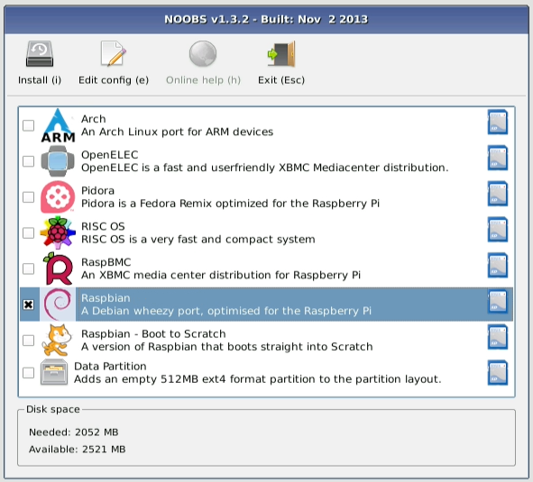

# Tema 7 - Instalación de Raspberry Pi

## Materiales

¿Qué necesito para trabajar con la Raspberry Pi?

* Raspbery Pi
* Tarjeta SD de al menos 4Gb
* Alimentación de 5V y al menos 2A (mejor si son 2.5A)
* Caja para evitar cortocircuitos
* Monitor HDMI (o VGA con adaptador)
* Teclado y raton USB (mejor si es inalambrico, porque consume menos)
* Conexión a la red: Cable ethernet o dongle Wifi
* Hub USB alimentado externamente (para evitar cargar demasiado a la Raspberry)

### ¿Dónde encontrarlos?

* [Kit base](http://www.electan.com/kit-raspberry-con-caja-alimentador-microsd-hdmi-usb-p-6584.html)
* [Shield electronica](http://tinkersphere.com/raspberry-pi-hats/633-starter-raspberry-pi-led-hat.html)
* [kit amazon](http://www.amazon.es/s/ref=sr_pg_2?rh=i%3Aaps%2Ck%3Araspberry+pi+2+kit+starter&page=2&sort=price-asc-rank&keywords=raspberry+pi+2+kit+starter&ie=UTF8&qid=1449858467)
* [Destacado 1](http://www.amazon.es/Raspberry-Pi-Quad-Core-Starter/dp/B00T7KW3Y0/ref=sr_1_15?ie=UTF8&qid=1449858467&sr=8-15&keywords=raspberry+pi+2+kit+starter)
* [Destacado 2](http://www.amazon.es/Raspberry-Pi-Quad-Starter-Bundle/dp/B00T7OHE9A/ref=sr_1_18?ie=UTF8&qid=1449858497&sr=8-18&keywords=raspberry+pi+2+kit+starter)

## Sistemas operativos disponibles

### [Noobs](https://www.raspberrypi.org/downloads/noobs/)

### [Raspbian](https://www.raspberrypi.org/downloads/raspbian/)

### [Ubuntu Mate](https://ubuntu-mate.org/raspberry-pi/)

### [Snappy Ubuntu Core](https://developer.ubuntu.com/en/snappy/start/#snappy-raspi2)

### [Windows 10 IOT Core](http://ms-iot.github.io/content/en-US/Downloads.htm)

### [OSMC](https://osmc.tv/download/)

### [Chrome OS](http://www.hwlibre.com/chrome-os-llega-raspberry-pi-otras-placas-sbc/)

### [Android](https://www.raspberrypi.org/magpi/android-raspberry-pi/)

### ([¿Dónde encontrarlos?](https://www.raspberrypi.org/downloads/))

Una vez elegida la imagen vamos a proceder a instalar

## Instalación

¿Qué necesitamos?

* Formatear tarjeta ([http://www.sdcard.org/downloads/formatter_4/](http://www.sdcard.org/downloads/formatter_4/))
* Descargamos la imagen del sistema que queramos [http://www.raspberrypi.org/download](http://www.raspberrypi.org/download)
* ¿Qué imagen usar?
	* Empecemos con [Noobs](https://www.raspberrypi.org/blog/tag/noobs/)
	* [Instalación de Noobs](https://www.raspberrypi.org/help/noobs-setup/)

* ¡¡¡Arrancar!!!
* Configuración

## Configuración

	sudo raspi-config

(Puede variar algo según la versión)

Una vez configurado podemos abrir el entorno visual con

	startx

En cualquier momento podemos volver a reconfigurar

	sudo raspi-config

## Simuladores

¿Y si no tengo una Raspberry Pi?

Existen [varios simuladores](https://www.google.es/search?q=raspberry+simulator&oq=raspberry+simulator&aqs=chrome..69i57j69i65l3j69i60l2.3806j0j7&sourceid=chrome&es_sm=93&ie=UTF-8) aunque no espere que la experiencia sea la misma....

TODO: Sobre la velocidad....

### [En windows](http://www.diverteka.com/?p=66)

* Descargamos la imagen en  [http://sourceforge.net/projects/rpiqemuwindows/](http://sourceforge.net/projects/rpiqemuwindows/)
* Emulador qemu
* Imagen (2012-07-15-wheezy-raspbian.img) o (http://downloads.raspberrypi.org/download.php?file=/images/raspbian/2013-05-25-wheezy-raspbian/2013-05-25-wheezy-raspbian.zip)

* Ejecutamos

		qemu-system-arm.exe -M versatilepb -cpu arm1176 -hda imagen/2013-09-25-wheezy-raspbian.img -kernel kernel-qemu -m 192 -append "root=/dev/sda2"

[Vídeo](http://www.youtube.com/watch?feature=player_embedded&v=QvqaNUx7-pU)

### [En ubuntu](http://www.cnx-software.com/2011/10/18/raspberry-pi-emulator-in-ubuntu-with-qemu/)

### [Simulando en virtualBox](https://www.raspberrypi.org/forums/viewtopic.php?f=9&t=2961)

### [Simulando el Sense Hat](https://www.raspberrypi.org/blog/sense-hat-emulator/)
