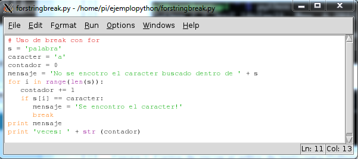

# Tema 9 - Programando con Raspberry Pi

## Programación en la Raspberry Pi

Existen distintas alternativas, dependiendo de los conocimientos previos, para programar en la Raspberry Pi.

* Scratch: para gente sin conocimientos previos de programación
* Python: lenguaje profesional, se necesitan otras habilidades (manejo de editores,...)
* Shell script: creando ficheros scripts podemos automatizar tareas

Existen diversas distribuciones destinadas completamente a usar la Raspberry como entorno de programación, algunos de ellos nos permiten aprender de una forma sencilla otros lenguajes.

Principalmente están pensados para facilitar la instalación de los entornos, que suele ser lo más complicado

* [Coder](https://googlecreativelab.github.io/coder/) Instala un servidor con todo lo necesario para montar un aula de aprendizaje de programación web

	Tiene varios [proyectos](https://googlecreativelab.github.io/coder-projects/) de diferente complejidad, con tutoriales


* [WebIDE](https://learn.adafruit.com/webide?view=all) Entorno Web que permite programar en Python, Ruby, Javascript y otros lenguajes


## Scratch

Es un entorno de programación gráfico que nos permite hacer programas usando bloques.

Podemos probarlo [online](https://scratch.mit.edu/projects/editor/)


Está pensado para enseñar a programar sin la complejidad de la sintaxis.

Otros similares

* [Snap!](snap.berkeley.edu)

* [Code.org](Code.org)


### Scratch en nuestra Raspberry Pi

La imagen Raspbian trae instalada una versión de Scratch

TODO: IMAGEN DE SCRATCH EN LA RASPI


## Shell Script

Los scripts son ficheros donde introduciomos distintas órdenes que se irán ejecutando de forma consecutiva una tras otra

Vamos a ver algunos ejemplos de cómo utilizarlos junto con la cámara.

### Usando la cámara


La cámara tiene su propio conector, junto a las conectores GPIO.

Antes de poder utilizarla tenemos que activarla

		sudo raspi-config


Tenemos 2 aplicaciones para usar la cámara

		raspistill


Tomará imágenes fijas

		raspivid

grabará un vídeo

### Imágenes estáticas

Si queremos cambiar el retardo con el se captura, usamos la opción -t indicando el tiempo en milisegundos:

		raspistill -o myimage.jpg -t 3000

Este programa tiene muchas opciones que podemos ver:

		raspistill | less
		-?, --help
		: This help information
		-w, --width
		: Set image width <size>
		-h, --height : Set image height <size>
		-q, --quality : Set jpeg quality <0 to 100>
		-o, --output : Output filename <filename>
		-v, --verbose : Output verbose information during run
		-t, --timeout : Time (in ms) before taking picture
		(if not specified, set to 5s)
		-th, --thumb
		: Set thumbnail parameters (x:y:quality)
		-d, --demo
		: Run a demo mode
		-e, --encoding : Output format (jpg, bmp, gif, png)
		-tl, --timelapse : Timelapse mode. Takes a picture every <t>ms
		-p, --preview : Preview window settings <'x,y,w,h'>
		-f, --fullscreen : Fullscreen preview mode
		-n, --nopreview : Do not display a preview window
		-sh, --sharpness : Set image sharpness (-100 to 100)
		-co, --contrast : Set image contrast (-100 to 100)
		-br, --brightness : Set image brightness (0 to 100)
		-sa, --saturation : Set image saturation (-100 to 100)
		-ISO, --ISO
		: Set capture ISO
		-vs, --vstab
		: Turn on video stablisation
		-rot, --rotation : Set image rotation (90,180,270)
		-hf, --hflip
		: Set horizontal flip
		-vf, --vflip
		: Set vertical flip

Entre estas opciones podemos encontrar **-tl** que nos va a permitir tomar una imagen cada cierto tiempo. Con ello podemos generar una secuencia de imágenes con una sola línea de comando

		raspistill -o myimage_%d.jpg -tl 2000 -t 25000

Una imagen cada 2 segundos durante 25 segundos Cada foto tendrá un número de secuencia

		myimage_1.jpg
		myimage_2.jpg
		myimage_3.jpg
		myimage_4.jpg
		...

 Si deseamos utilizar un formato de nombre más complejo, siempre podemos usar un script como el siguiente que además guardará las imágenes en una carpeta

		SAVEDIR=/var/tlcam/stills
		while [ true ]; do
		filename=$(date -u +"%d%m%Y_%H%M-%S").jpg
		/opt/vc/bin/raspistill -o $SAVEDIR/$filename
		sleep 4;
		done;

### Vídeo

raspivid  nos va a permitir grabar vídeos. Para capturar 5s de vídeo en formato h264 utilizaremos:

	raspivid -o video.h264

Si queremos capturar 10 segundos usaremos:

	raspivid -o video.h264 -t 10000

Para ver todas las opciones disponibles podemos hacer

	$raspivid | less

Para una documentación más detallada sobre las opciones del ejecutable se puede consultar el siguiente [enlace](https://github.com/raspberrypi/userland/blob/master/host_applications/linux/apps/raspicam/RaspiCamDocs.odt)

### Webcam

Podemos usar cámaras USB compatibles  como  la PS3 Eye.

Veremos si se ha detectado con:

	$ ls -l /dev/video*

Si se detecta


Instalamos fswebcam

	 sudo apt-get install fswebcam

Que nos permitirá tomar una imagen con

	 fswebcam -d /dev/video0 -r 640x480 test.jpeg

Hagamos ahora un script para hacer un timelapse

	#!/bin/bash
	# Timelapse controller for USB webcam
	DIR=/home/pi/timelapse
	x=1
	while [ $x -le 1440 ]; do
		filename=$(date -u +"%d%m%Y_%H%M-%S").jpg
		fswebcam -d /dev/video0 -r 640x480 $DIR/$filename
		x=$(( $x + 1 ))
		sleep 10;
	done;

Podemos ver que se están realizando capturas de imágenes cada 10 segundos y como mucho se guardarán 1440 imágenes.


	./runtimelapse

### Control remoto de cámaras


También podemos controlar cámaras profesionales que suelen admitir conexión USB (como por ejemplo una Canon Rebel T4i / 650D)

Utilizaremos el software gphoto2 que  instalaremos con

	 	sudo apt-get install gphoto2

Podemos controlar casi todos los valores de exposición, ISO, etc de nuestra cámara remotamente, pero para no complicarnos vamos a suponer que la usamos en modo automático.

Podemos capturar una imagen, que se mantendrá en la cámara con:

		$ gphoto2 --capture-image

Para tomar una imagen y enviarla a la raspberry usaremos

		$ gphoto2 --capture-image-and-download

La librería gphoto2 por defecto guarda las imágenes en la memoria RAM de la Raspberry (no en la SD) con lo que es necesario que lo configuremos para evitar perderlas al cortar la alimentación.

		$ gphoto2 --get-config /main/settings/capturetarget

Para establecer nuestro almacenamiento usaremos:

		$ gphoto2 --set-config /main/settings/capturetarget=NuestroDirectorio

Veamos ahora como hacer un time-lapse, es decir capturar las imágenes cada
cierto tiempo. Usaremos el siguiente comando.

		$ gphoto2 --capture-image -F 1440 -I 30

Que almacenará en la cámara un máximo de 1440 imágenes tomadas cada 30
segundos

### Convertir fotos a vídeo

Una vez tengamos todas las imágenes podemos generar un vídeo con ellas.

Instalamos un software llamado mencoder que será el que genere el vídeo.

		$ sudo apt-get install mencoder

 Ahora generamos un fichero que contenga todas las imágenes que queremos unir en el vídeo

		$ cd timelapse
		$ ls *.jpg* > list.txt


Y ejecutamos memcoder con los parámetros adecuados (es una sóla línea)

		$ mencoder -nosound -ovc lavc -lavcopts vcodec=mpeg4:aspect=16/9:vbitrate=8000000 -vf scale=640:480 -o timelapse.avi -mf type=jpeg:fps=24 mf://@list.txt

Con esto generaremos un vídeo de 640x480 de resolución, con nombre timelapse.avi codificado en mpeg4, a 24 frame por segundo y con las imágenes cuyos nombres se incluyen en el fichero list.txt

Si queremos hacer un vídeo a partir de las imágenes tomadas con la cámara original de Raspberry usaremos el siguiente comando

		$ mencoder -nosound -ovc lavc -lavcopts vcodec=mpeg4:aspect=16/9:vbitrate=8000000 -vf scale=1920:1080 -o tlcam.avi -mf type=jpeg:fps=24 mf://list.txt

Hay que tener cuidado de no llenar el almacenamiento, puesto que este proceso consume mucho espacio

## Python


Es un lenguaje moderno de gran productividad, sencillo, potente y con millones de líneas ya desarrolladas que se pueden usar directamente por medio de paquetes instalables

Se utiliza en la web, en aplicaciones de escritorio, etc... Gran parte del interface de linux lo utiliza

Existen dos versiones de python ahora mismo: la rama 2.x y la 3.x
Por sencillez vamos a usar la sintaxis de la rama 2.x

Podemos utilizar la herramienta Idle o python directamente para programar con él.



Es más sencillo si escribimos nuestro código en un fichero (con cualquier editor de texto) y luego lo ejecutamos o bien abriéndolo con idle o haciendo:

    python fichero.py


Veamos algunos ejemplos

## Operaciones numéricas y petición de datos al usuario

[Código de Suma](./codigo/suma.py)

```python
# Programa que realiza la suma de dos valores
a=input('numero 1');
b=input('numero 2');
suma = a + b;
print (suma);
```

**Ejercicio**: cambia la operación a realizar

### Sentencias de control condicionales

[Código de Bisiesto](./codigo/bisiesto.py)

```python
# Programa que determina si un año es o no bisiesto
year = input('Introduzca el anio: ');
if ((year%400)==0  or (year % 100) ==0 or (year%4)==0):
  print 'Es bisiesto!!';
else:
  print 'No es bisiesto!!';
```

[Código de días por mes](./codigo/diasMes.py)

```python
# Nos da los dias que tiene el mes seleccionado
mes = input('Introduce el mes:');
year = input('Introuce el anio:');
# Comprobamos si es entero
if type(mes) == int:
  # Comprobamos si esta entre 1 y 12
  if (mes>=1) and (mes<=12):
    if mes == 2:
      if(year%400 == 0) or (year%100 ==0) or (year %4 == 0):
        dias = 29;
      else:
        dias =28;
    elif (mes==4) or (mes==6) or (mes==9) or (mes==11):
      dias = 30;
    else:
      dias = 31;
    print 'El mes '+str(mes) +' del anio '+str(year)+' tiene '+str(dias)+ ' dias';
  else:
    print 'El mes debe ser entre 1 y 12';
else:
  print 'El mes debe ser entero';
```

### Sentencias de control de repetición

[Código de Buscando Caracteres](./codigo/buscaCaracter.py)

```python
# Cuenta las veces que se repite un caracter en una palabra
word= 'palabra';
caracter = 'a';
contador=0;
mensaje='No se ha encontrado el caracter :('
for i in range(len(word)):
  if (word[i]==caracter):
    mensaje='se ha encontrado el caracter!!!';
    contador=contador+1;

print mensaje;
print 'Se encontrado '+str(contador)+' veces';
```

**Ejercicio**: haz que el usuario pueda introducir la cadena donde buscar y el carácter

### Diccionarios que nos permitirán relacionar contenidos

Un diccionario es una forma sencilla de acceder a contenido a partir de una clave.

Podemos ver un pequeño ejemplo de uso si introducimos estas líneas en idle (las que empiezan por >>>)


### Programa complejo

Veamos una implementación de un programa más elaborado como "Piedra, Papel o Tijera"


### Aplicaciones hechas en python

Vamos a ver cómo hacer aplicaciones con Python.

Utilizaremos la libre pyGTK que permite crear e interaccionar con ventanas desde Python.

[Tutorial de la OSL](https://github.com/oslugr/curso-python-avanzado/blob/master/Interfaces_Graficas_con_PyGTK/contenido_PyGtk.md)

	#!/usr/bin/python
	# -*- coding: utf-8 -*-
	from gi.repository import Gtk

	class MyWindow(Gtk.Window):

	    def __init__(self):
	        Gtk.Window.__init__(self, title="Hola Mundo!")

	        self.button = Gtk.Button(label="Hazme click")
	        self.button.connect("clicked", self.on_button_clicked)
	        self.add(self.button)

	    def on_button_clicked(self, widget):
	        print("Hola Mundo!")

	def main():
	    win = MyWindow()
	    win.connect("delete-event", Gtk.main_quit)
	    win.show_all()
	    Gtk.main()

	main()


Utilizaremos Glade para diseñar el interface


### PyGame

Si lo que queremos hacer es un juego podemos usar pyGame

[Ejemplo sencillo](https://github.com/oslugr/curso-python-avanzado/blob/master/Videojuegos_con_PyGame/hola_pygame.md)

		#!/usr/bin/env python
		# -*- coding: utf-8 -*-

		# Importamos la librería
		import pygame

		# Iniciamos Pygame
		pygame.init()

		# Creamos una surface (la ventana de juego), asignándole un alto y un ancho
		Ventana = pygame.display.set_mode((600, 400))

		# Le ponemos un título a la ventana
		pygame.display.set_caption("Hola Mundo")

[Ejemplo de animaciones](https://github.com/oslugr/curso-python-avanzado/blob/master/Videojuegos_con_PyGame/animando_sprites.md)


[Tutorial de la OSL](https://github.com/oslugr/curso-python-avanzado/tree/master/Videojuegos_con_PyGame)

# Python y la cámara: openCV

Vamos a ver cómo utilizar librerías de reconocimiento de objetos para detectar formas y colores en imágenes provenientes de la cámara

[Vídeo demostración](https://www.youtube.com/watch?v=CigGvt3DXIw)

Usaremos la librería OpenCV, librería desarrollada para trabajar en sistemas de
reconocimiento de imágenes.

Es una de las más utilizadas
Funcionar independientemente de la fuente de las imágenes, (tiempo real o imágenes almacenadas)

Un proyecto sencillo: detectar la posición de unos círculos en la imagen.

(Deteccion de una pelota en el suelo. Basta con que sepamos “restar” el fondo a nuestra
imagen)


Instalamos

	 	sudo apt-get install python-opencv

Veamos el código necesario. Comenzaremos incluyendo los paquetes que vamos a utilizar:

		import os
		import cv2
		import math

Vamos a reescalar todas las imágenes para así trabajar siempre con imágenes de un 1⁄4 del tamaño original. Podemos encontrar más detalles sobre las transformaciones geométricas disponibles en la documentación de openCV:

		## Usamos el método resize para re-escalar
		def resizeImage(img):
			dst = cv2.resize(img,None, fx=0.25, fy=0.25, interpolation =
			cv2.INTER_LINEAR)
			return dst

Supondremos que capturamos la imagen con la cámara de la Raspberry con raspistill, pero si no fuera así, basta con cargar las imagen estática que tengamos (os.system ejecuta un comando del sistema):

		## Capturamos la imagen con la cámara de la Raspberry Pi
		os.system("raspistill -o image.jpg")

Ahora cargaremos la imagen, primero en color y luego en escala de grises (ya vamos viendo la potencia de la librería, facilitándonos este tipo de cosas)

		## Cargamos la imagen
		img = cv2.imread("/home/pi/Desktop/image.jpg")
		grey = cv2.imread("/home/pi/Desktop/image.jpg",0) #0 para la escala de grises

A partir de la imagen en grises obtendremos una imagen en blanco y negro utilizando un valor umbral de 50 y convirtiendo cualquier pixel que tetga un valor mayor en uno negro (255).

		## convertimos la imagen en grises en una en blanco y negro
		ret, thresh = cv2.threshold(grey,50,255,cv2.THRESH_BINARY)

A partir de esta imagen, aplicamos un método llamado HoughCircle para encontrar el centro de los círculos. Es posible que tengamos que modificar estas valores para el caso concreto de nuestras imágenes.

		## el método houghcircles encuentra el centro de los círculos
		circles = cv2.HoughCircles(thresh,cv2.cv.CV_HOUGH_GRADIENT, 1,75,param1=50,param2=13,minRadius=0,maxRadius=175)

El resultado será un conjunto de tuplas de 3 valores: x,y y el radio, que recorreremos para dibujar sobre la imagen los círculos detectados.

		for i in circles[0,:]:
			# dibujamos el círculos exterior
			cv2.circle(img,(i[0],i[1]),i[2],(0,255,0),2)
			# dibujamos el centro
			cv2.circle(img,(i[0],i[1]),2,(0,0,255),3)

Sólo nos queda dibujar estas imágenes de vuelta en nuestra raspberry

		## Re-escalamos las imágenes
		img = resizeImage(img)
		thresh = resizeImage(thresh)
		## las mostramos en pantalla
		cv2.imshow("thresh",thresh)
		cv2.imshow("img",img)


## APIS : conectando con el mundo exterior

Una de las ventajas de usar linux es que podremos integrarnos con muchos dispositivos para los que ya existen programas

### Integración con gtalk

Vamos a crear un bot que realiced las acciones que le enviemos desde cualquier dispositivo

	$ sudo apt-get install python-pip git-core python2.7-dev

Ahora actualizamos la lista de paquetes

		$ sudo easy_install -U distribute

Procedemos ahora a instalar los paquetes que vamos a necesitar

		$ sudo pip install Rpi.GPIO xmpppy pydns

Podemos [descargar el código](https://github.com/mitchtech/raspi_gtalk_robot) del enlace correspondiente.

En este código tendremos que cambiar los valores de las 3 variables a los correspondientes correos y contraseñas:

		BOT_GTALK_USER = 'bot_username@gmail.com'
		BOT_GTALK_PASS = 'password'
		BOT_ADMIN = 'admin_username@gmail.com'

Una vez configurado, lo ejecutamos (como root debido a que usa GPIO).

		$ sudo python ./raspiBot.py

y tendremos accesibles los siguientes comandos:

		[pinon|pon|on|high] [pin] : activa el GPIO pin
		[pinoff|poff|off|low] [pin] : apaga GPIO pin
		[write|w] [pin] [state] : escribe el estado en GPIO pin
		[read|r] [pin]: lee el estado de GPIO pin
		[shell|bash] [arg1] :ejecuta el comando que sigue a "shell" o "bash"

### Reconocimiento de voz

Usaremos el API de Google, pero antes tenemos que digitalizar la voz para lo que instalaremos el paquete ffmpeg

		$ sudo apt-get install ffmpeg

Con este paquete crearemos un fichero que enviaremos a google via su API para recuperar el texto. Veamos todo esto en un script al que llamaremos speech2text.sh y al que daremos permiso de ejecución (chmod +x speech2text.sh)

		$ #!/bin/bash
		echo "Grabando.. Pulse Ctrl+C para parar."
		arecord -D "plughw:1,0" -q -f cd -t wav | ffmpeg -loglevel panic -y -i - -ar 16000 -acodec flac file.flac > /dev/null 2>&1
		echo "Procesando..."
		wget -q -U "Mozilla/5.0" --post-file file.flac --header "Content-Type:audio/x-flac; rate=16000" -O - "http://www.google.com/speech-api/v1/recognize?lang=en-us&client=chromium" | cut -d\" -f12 >stt.txt
		echo -n "Dijiste: "
		cat stt.txt
		rm file.flac > /dev/null 2>&1


### Preguntando a WolphranAlpha

Instalamos lo necesario

		$ apt-get install python-setuptools easy_install pip
		$ sudo python setup.py build
		$ sudo python setup.py

Y este es el código

		#!/usr/bin/python
		import wolframalpha
		import sys
		# Obtenemos una clave en http://products.wolframalpha.com/api/
		# reemplaza la siguiente por la clave obtenida.
		app_id='HYO4TL-CLAVE'
		client = wolframalpha.Client(app_id)
		query = ' '.join(sys.argv[1:])
		res = client.query(query)
		if len(res.pods) > 0:
			texts = ""
			pod = res.pods[1]
			if pod.text:
				texts = pod.text
			else:
				texts = "No hay respuesta"
			# filtramos los caracteres
			texts = texts.encode('ascii', 'ignore')
			print texts
		else:
			print "No hay respuesta"

### Haciendo que nos hable nuestra Raspberry Pi

Instalamos el reproductor mplayer

		sudo apt-get install mplayer

Y con este script podemos hacer que nos lea lo que queramos

		#!/bin/bash
		say() { local IFS=+;/usr/bin/mplayer -ao alsa -really-quiet -noconsolecontrols "http://translate.google.com/translate_tts?tl=en&q=$*"; }
		say $*
